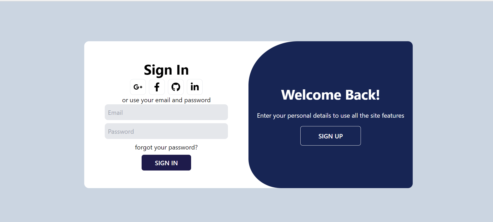
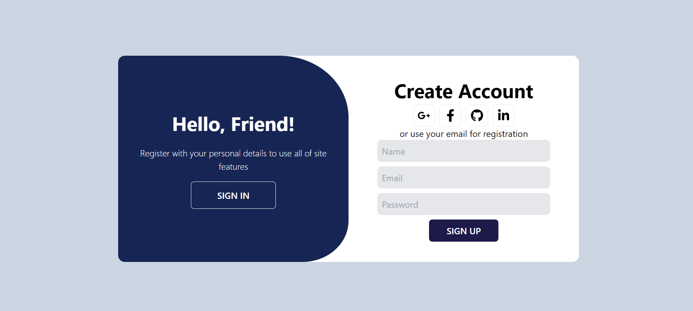
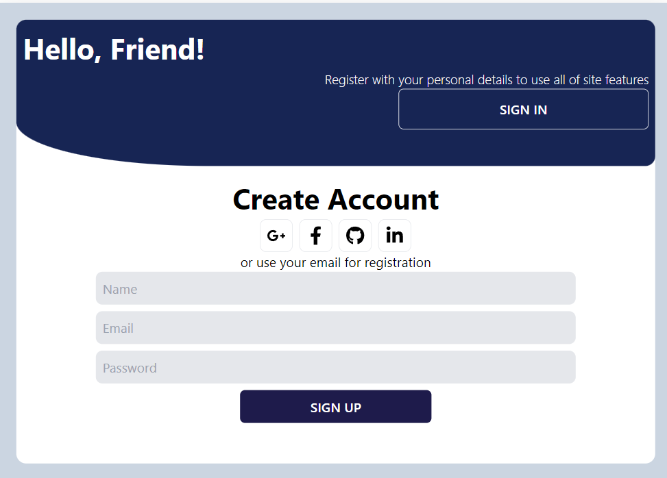
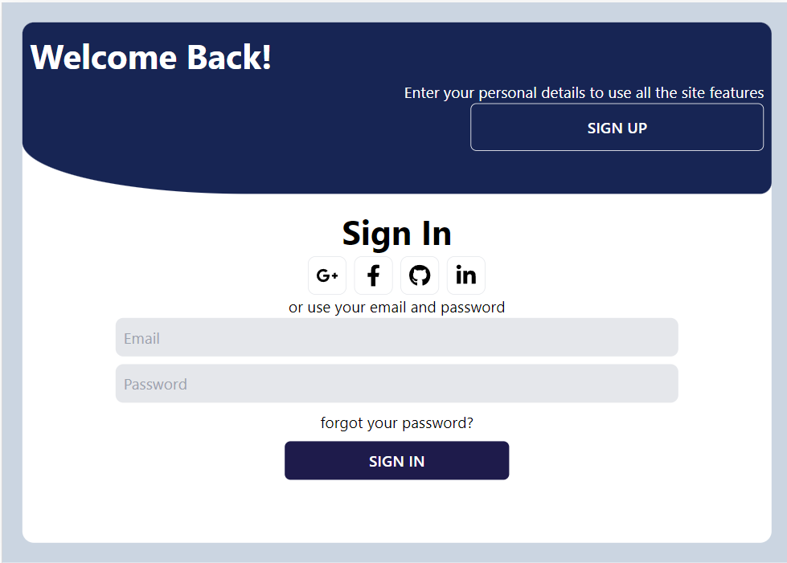

# Modern Login and Sign Up form - Single page React App

This project solution, is a Modern Form, that allows both sign-up view and login view, but each is shown once at a go. To toggle between different views, a descriptive button is provided. The transition is made to look smooth, with sliding views; this was enabled with CSS animations and keyframes. Continue reading to get more insight of the project.

## Table of contents

-[Overview](#overview) -[Getting Started](#getting-started) -[Screenshot](#screenshot) -[Links](#links) -[My process](#my-process) -[Built with](#built-with) -[What I learned](#what-i-learned) -[Continued development](#continued-development) -[Useful resources](#useful-resources) -[Author](#author) -[Acknowledgements](#acknowledgments)

## Overview

### Getting Started

Clone this GitHub repository, open the terminal(must have git-bash) and run:

```npm
npm install

npm run dev
```

or

```npm
yarn install

yarn dev
```

or if you have vite installed, (with this you'll view the project in devices with protrait screens like phones)

```npm
vite --host
```

### Screenshots






### Links

-Solution URL: [GitHub Link](https://github.com/Jaweki/modern-login-signup-form)
-Live Site URL: [Deployed on Vecel](https://modern-login-signup-form.vercel.app/)

## My Process

### Built With

- Vite
- CSS Animation properties and Keyframes
- Flexbox
- CSS media query
- [React](https://reactjs.org/) - JS library
- [Tailwind CSS](https://tailwindcss.com/)

### What I learned

This project was a great opportunity for learning how to Implement animations in html elements. The understanding of how Keyframes and transform properties get to be implemented was key. see example code:

```css
.signup-banner-portrait {
  animation: signup-banner-portrait-animate 1s ease;
  transform: translateY(0);
}

@keyframes signup-banner-portrait-animate {
  from {
    transform: translateY(-100%);
  }

  to {
    transform: translateY(0);
  }
}
```

[View more of that implementation](./src/index.css)

### Continued development

For future projects of this kind, I would like to implement input validation. More to that, I would be nice if the form was intergrated to an advanced web app, so that tasks such as data transfer to the server, can be implemented.

### Useful resources

- [CSS Animations](https://www.w3.org/TR/css-animations-1/) - The Documentation at W3C website, is gives detailed instructions and guide of how animations get cascaded in the html document and on what conditions does certain CSS properties work. Also it expalins the Precedence of Cascading CSS properties.
- [Tailwind CSS](https://tailwindcss.com/docs/screens#custom-media-queries) - Learn more about Easy styling for different screen sizes. With Tailwind CSS, the implementation of CSS styles is easy and fast, with the inline utility css styles. Tailwind is a good ccs tool for developers.

**More Can be learnt from this project, Like CSS Flexbox styling, React development, typescript, and more.**

## Author

- Website - [Jaweki Portfolio](https://portfolio.jaweki.com)
- LinkedIn Profile - [Jack (Kioni) Weru](www.linkedin.com/in/jaweki-dekut)
- X.com - [@JackKioni](https://twitter.com/search?q=%40JackKioni&src=typed_query)
